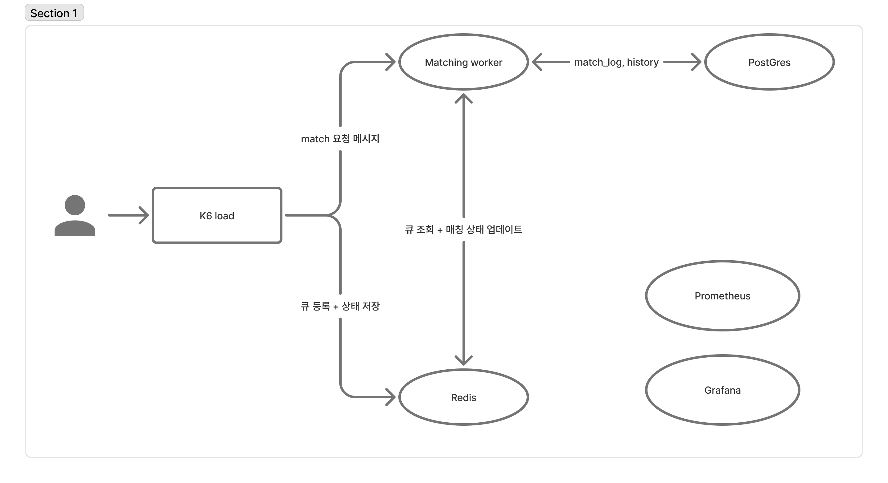

# Desing Docs (매칭 관련) - By Kihong (ver.1.2)

# 1. 개요

문서 목

본 문서는 Spring Boot 단일 서버 환경에서 동작하는 Redis 기반 1:1 매칭 로직의 구조 및 처리 흐름을 정의한다. 이 문서는 매칭 로직 그 자체만을 설명하며, 연결(WebRTC), 시그널링, 인증, UI 등 다른 시스템은 범위에 포함되지 않는다.

목적은 다음과 같다.

- 효율적인 매칭 큐 운영 방식 정의
- Redis 기반 상태/대기열 저장 구조 정의
- 단일 서버 워커 기반 매칭 알고리즘 설명
- join/leave/status API 기준 정의
- 성능 요구사항(매칭 속도) 제시

대상 독자 : 살랑 팀원

시스템 범위 :

- 실 서비스에서 Redis를 써야 하는지 판단 근거 확보
- 매칭 필터가 늘어날 때 해당 구조가 유리한지 판단.
- **1,000 VU 기준**, 처리 속도와 안정성 확인

> 버전 기준 : Gradle 8.14.3 / Spring Boot 3.4 / Java 17
>
> **Infra: Docker Compose + PostgreSQL(Supabase) + Redis + Prometheus + Grafana + Loki (PLG Stack)**

## 1.2 실험 구조

### 실험 제안 구조 : Redis 기반 매칭 구조 (분산 가능 모델)

```scss
K6 → Spring Boot → Redis(ZSET)
                     ↳ Worker
```

- 특징
  - 대기자 정렬/우선순위/만료 등 확장이 쉽다.
  - 수평 확장 가능
  - 원자성 보장 → 경합 해결 용이
  - 하지만 Redis I/O 비용 발생

## 1.3 목표 (Goal)

매칭 로직의 목표는 다음과 같다:

1. 사용자가 큐에 들어오면

   → **짧은 시간 내에** 적합한 상대를 매칭한다.

2. 매칭 알고리즘은 Simple & Fast 해야 한다

   → 음성 매칭 특성상 200~300ms 안에 매칭 결정되도록 설계.

3. 단일 서버 환경에서 스레드 기반 Worker가 매칭을 처리한다.
4. Redis를 사용하여 재시작에도 대기열 상태를 유지한다.

## 1.4 매칭 로직이 수행하는 역할

매칭 로직은 다음 단계만 수행한다:

1. **JoinQueue**
   - 대기열 삽입
   - 상태 = WAITING
2. **FindMatch (Worker)**
   - Redis에서 상위 N명 조회
   - WAITING 사용자 중 조건이 맞는 1쌍 매칭
3. **UpdateMatchResult**
   - 두 유저 상태를 MATCHED로 변경
   - 큐에서 제거
4. **LeaveQueue**
   - 유저가 취소 시 제거

이 4가지 기능이 매칭 로직의 전체 역할이다.

---

# 2. 요구사항 정의

## 2.1 기능 요구사항

### 1) 큐 등록 (JoinQueue)

사용자가 매칭을 요청하면 Redis 기반 대기열(ZSET)에 등록된다.

- user:{id}:status 조회
  - WAITING ⇒ 이미 대기 중, 즉시 반환
  - MATCHED ⇒ 매칭 완료 상태이므로 큐 참여 불가
- Join debounce 적용
  - user:{id}:lastJoinAt 기준 1초 미만 재요청은 차단 (429 반환)
- 상태 등록
  - Set user:{id}:status = WAITING
  - SET user:{id}:lastJoinAt = now
- 대기열 등록
  ZADD matching:queue <joinedAtEpochMillis(double)> <userId>
  (score는 double 기반이며 epochMillis를 그대로 저장해도 precision 문제 없음)
  - 정렬 기준 : 오래 기다린 유저가 먼저 매칭되도록 오름차순(ZRANGE)
- 성공 응답 반환

Redis Key 구조

```scss
user:{id}:status      = WAITING | MATCHED | IDLE
user:{id}:lastJoinAt  = epochMillis
```

---

### 2) 후보 탐색 (Candidate Selection)

Worker는 50ms 주기로 다음 작업을 수행한다.

- Worker는 `ZRANGE matching:queue 0 49`로 **오래 기다린 상위 50명만 조회**한다.

**후보 필터링**

- 자기 자신 제외
- 상태 = `WAITING`인 유저만 선택
- 필수 조건 충족 (현재는 **성별 동일**만 적용)

※ 성능 최적화를 위해 deep scan은 수행하지 않음.

※ 조건 확장 시에도 Top-N scanning 모델 유지 가능.

---

### 3) 매칭 조건 (Matching Condition)

기본 조건은 심플해야 하며, 프로덕션에서도 확장 가능해야 한다.

- 기본 조건:
  - **성별 동일**
- 확장 가능 조건(나이, 취미, 지역 등)은 추후 도입 가능하도록 문서화만 유지.

---

### 4) 매칭 Pair 결정 (Matching)

- Worker는 Top-50 후보 목록에서 다음 순서로 Pair를 결정한다:
  1. 자기 자신을 제외
  2. Redis에서 상태가 `WAITING`인지 확인
  3. 매칭 조건 충족 시 Pair 확정
- 매칭 확정 처리 (Lua Script 기반 원자 처리)
  - 두 유저의 상태가 **WAITING**인지 Lua Script에서 검증한다
  - 검증 후 상태를 MATCHED로 변경
  - user:{id}:matchedWith = 상대 userId 저장
  - ZSET에서 두 유저 제거
    - ZREM matching:queue A B

“matchedWith 설정은 Worker가 아닌 **Lua Script 내부에서 원자적으로 처리된다**.”

---

### 5) 매칭 실패 처리

- Top-50 내에서 조건을 만족하는 상대가 없으면 이번 tick은 실패
- Worker는 50ms 후 다시 Top-50을 조회하여 재시도
- deep scanning(100~500명 단위)은 POC에서는 적용하지 않음
  - 이유: POC 목적은 구조 검증이며, 성능 대비 효율성이 낮음
  - 향후 최적화 단계에서 확장 가능

---

### 6) 이탈 처리 (LeaveQueue)

사용자가 매칭을 취소할 경우:

1. `ZREM matching:queue {id}`
2. `SET user:{id}:status = IDLE`

단, 상태가 MATCHED인 경우 LeaveQueue는 허용되지 않는다

(이미 매칭되었기 때문에 방/연결 단계로 넘어가기 때문).

---

### 7) 상태 조회 (CheckStatus)

사용자의 현재 매칭 상태는 **Redis만** 조회한다.

반환 값:

- IDLE
- WAITING
- MATCHED
- matchedWith (MATCHED일 때만)

Redis Keys:

```scss
user:{id}:status
user:{id}:matchedWith
```

---

### 8) 매칭 결과 저장 (Postgres)

매칭 확정 후, Worker는 아래를 수행한다:

1. Postgres `match_history` 테이블에 기록 저장
2. Redis는 **실시간 상태만 보관**, 이력에 대한 책임은 Postgres가 가짐

스키마

```scss
match_history(
  id UUID PK,
  user_a_id UUID,
  user_b_id UUID,
  matched_at TIMESTAMP,
  match_duration_ms INT (optional)
)
```

Postgres는 **영구 저장소**이며, 이후 운영/분석/이력 조회에 사용한다.

---

### 9) MATCHED 상태 유지 및 삭제

매칭 성공시 Redis에는 :

```scss
user:{id}:status       = MATCHED
user:{id}:matchedWith  = 상대ID
```

클라이언트가 매칭 완료 이벤트(ACK)를 보내면:

```scss
DEL user:{id}:matchedWith
SET user:{id}:status = IDLE
```

Redis는 임시 상태 저장소이며, MATCHED 상태는 짧게 유지된다.

---

## 2.2 비기능 요구사항

- **지연/성능**
  - JoinQueue < 50ms
  - 매칭 결정 평균 < 200ms
  - Redis ZRANGE 응답 < 5ms
  - Worker tick = 50ms (즉, 초당 20회 매칭 스캔)
- **일관성**
  - 매칭의 Source of Truth는 **Redis 상태 + ZSET**
  - 이력의 Source of Truth는 Postgres
  - Redis 장애 시:
    - JoinQueue → 503 반환
    - Worker 중단
    - 서버 재시작 시 Redis 대기열은 그대로 유지되어야 함
- 확장성
  - 현재는 단일 서버 기반이지만
    Redis 기반으로 설계했기 때문에
    추후 멀티 서버로 확장 시 매칭 로직은 그대로 유지 가능
  - Lua Script 기반 원자 연산을 사용하므로
    - Worker 다중 실행 시에도 안정성 확보 가능
- 모니터링
  다음 항목을 Prometheus와 grafana로 노출:
  - queue length (ZCARD) : 매칭 대기열(ZSET)에 현재 얼마나 많은 유저가 기다리는지 개수.
  - worker tick latency : 매칭 워커가 한 번 실행(틱)할 때 걸린 시간(처리 속도).
  - matching success count : 매칭이 성공적으로 성사된 횟수.
  - matching failure count : 매칭을 시도했지만 실패한 횟수(조건 불충족, 시간초과 등).
- 보안 및 개인 정보 보호
  - Redis에는 오직 매칭에 필요한 최소 정보만 저장
  - 실명/전화번호 등 민감 정보는 절대 Redis로 전달하지 않음
  - Postgres의 매칭 이력에는 userId만 저장하며 프로필 데이터는 포함하지 않음
- 운영 정책
  - Postgres 이력은 삭제하지 않는다
  - 운영자가 별도 페이지에서 match history 조회 가능하도록 설계
  - Redis는 장애 복구 시 자동으로 재구성 필요 없음

---

# 3. 시스템 아키텍처

## 3.1 아키텍처 다이어그램



본 POC 시스템은 **Spring Boot 단일 서버 환경**에서 동작하는

**실시간 1:1 음성 매칭 로직**이다.
API 호출은 **모두 k6 Load Generator**를 사용하여 시뮬레이션한다.

매칭의 핵심 흐름은 다음 세 가지로 구성된다:

1. **Redis**
   - 실시간 매칭의 상태 저장소
   - ZSET 기반 대기열
   - 사용자 상태(STATUS, matchedWith, lastJoinAt) 저장
   - 매칭 알고리즘의 Source of Truth
2. **Worker(내부 Background Thread)**
   - 서버 내부에서 동작하는 50ms 간격 루프
   - Redis ZSET을 기반으로 후보 조회
   - 조건 검사 후 Pair 결정
   - Lua Script로 원자적 MATCH 처리
3. **Postgres**
   - 매칭 이력 영구 저장소
   - 운영/통계/조회 목적

API 서버(Spring Boot)는 JoinQueue / LeaveQueue / Status / ACK / History API를 제공하며,

매칭 처리 자체는 Worker가 전담한다.

## 3.2 주요 컴포넌트 설명

---

### 1. API 서버

- 사용자의 요청을 받아 Redis와 통신하여 **상태 기반 매칭 로직의 입구 역할**을 한다.

### 담당 기능:

- `POST /queue/join` → WAITING 등록
- `POST /queue/leave` → WAITING → IDLE
- `GET /queue/status` → Redis 상태 조회
- `POST /queue/ack` → MATCHED 처리 종료
- `GET /history` → Postgres 이력 조회
- 특징:
  - JoinQueue 시 debounce(1초) 적용
  - 상태 조회는 오직 Redis 조회
  - 이력 조회는 오직 Postgres 조회

---

### 2. Redis

매칭 로직의 모든 실시간 데이터는 Redis에서 관리된다.

- 저장되는 데이터
  - **matching:queue (ZSET)**
    - score = joinedAtTimestamp
    - 오래 기다린 유저 우선 (ZRANGE 0 49)
  - **user:{id}:status**
  - **user:{id}:matchedWith**
  - **user:{id}:lastJoinAt**
- 역할:
  - Lua Script를 통한 원자적 MATCHED 처리
- 빠른 읽기/쓰기를 위한 선택

---

### 3. Matching Worker

50ms 주기로 실행되는 **단일 스레드 Loop Worker**.

### Worker Loop:

1. ZRANGE로 상위 50명 조회
2. WAITING 상태 필터
3. 매칭 조건(성별 동일) 검사
4. Pair 발견 시 Lua Script로 원자 처리
   - 상태 WAITING → MATCHED
   - matchedWith 저장
   - ZREM queue
5. Postgres에 match_history INSERT
6. 다음 tick까지 sleep(50ms)

### Worker가 1개면 좋은 이유:

- race-condition 없음
- worker 간 충돌 없음
- POC/1000명 규모에서는 성능 충분
- 단일 queue-consumer 구조는 산업 표준

---

### **4. Postgres (이력 저장소)**

**영구 데이터를 저장하는 DB** (운영자 페이지 / 통계 등)

### 데이터:

- user_a_id
- user_b_id
- matched_at

### 특징:

- Redis와 목적이 다름
- 실시간 매칭 로직에 관여하지 않음
- 매칭 성공 시에만 INSERT

---

### 5. K6 Load Generator

POC 환경의 유일한 “유저 역할”.\

**역할**

- JoinQueue API 반복 호출 (1000명 동시 simulated user)
- Status API Polling
- MATCHED 수신 후 ACK API 호출
- 부하 테스트 (1000 VU)
- LeaveQueue 요청 시뮬레이션

**특징**

- 실제 Client App UI는 없음
- k6가 모든 요청을 대체
- 성능 테스트/부하 테스트 목적

---

### 6. Grafana (모니터링 UI)

POC 결과를 확인하는 정식 UI.

### 시각화 항목

- queue length (`ZCARD`)
- worker tick latency
- match success count
- match fail count
- throughput
- Redis error count
- Postgres insert latency

---

### 7. Prometheus

POC에서 필수적인 시간·성능 메트릭 저장소.

**수집 메트릭**

- worker_tick_latency : 매칭 Worker 루프(50ms tick)가 **얼마나 빨리 수행되는지** 측정.
  - 목적 : Worker 전체 성능
- redis_zrange_latency : 매칭 로직의 핵심인 **Top-50 조회(ZRANGE)**의 Redis 응답 시간을 측정.
  - 목적 : Top-50 조회 성능
- redis_lua_latency : 매칭 확정 atomic 처리(Lua Script)의 성능을 측정.
  - 목적 : 매칭 확정 처리 성능
- match_success_count : 매칭 로직의 “압력 테스트 결과” 측정.
  - 목적 : 성공율 측정
- match_fail_count : 매칭 로직의 “압력 테스트 결과” 측정.
  - 목적 : 실패율 측정
- match_queue_length(ZCARD) : 현재 매칭 대기열의 크기(ZSET 크기) 모니터링.
  - 목적 : 시스템 backlog 판단

Prometheus는

Spring Boot Actuator + Custom Metrics로 구성됨.

---

# 4. 상태 설계

매칭 시스템은 Redis 기반으로 사용자 상태를 관리하며,

이번 POC에서는 실시간 매칭에 필요한 최소 상태만 정의한다.

## 4.1 상태 정의

### 4.2 전이 다이어그램 (Transition Diagram)

| 상태        | 설명                                        | Redis Key                                                     |
| ----------- | ------------------------------------------- | ------------------------------------------------------------- |
| **IDLE**    | 매칭 큐에 참여하지 않은 기본 상태           | `user:{id}:status = IDLE`                                     |
| **WAITING** | 매칭을 위해 Redis ZSET 큐에 등록된 상태     | `user:{id}:status = WAITING`                                  |
| **MATCHED** | 매칭이 성사된 상태로, 상대와 연결 준비 상태 | `user:{id}:status = MATCHED` `user:{id}:matchedWith = 상대ID` |

이 3가지 상태 외에

**WAITING_RELAXED_n, TIMEOUT, PROPOSED 등은 사용하지 않는다.**

POC에서는 단순 매칭 성능 검증이 목적이므로 최소 상태셋이 가장 적합하다.

## 4.2 상태 전이 흐름 (State Transitions)

아래는 사용자 상태가 변하는 흐름이다.

```
    ┌───────────────┐
    │     IDLE       │
    └───────┬────────┘
            │ JoinQueue
            ▼
    ┌───────────────┐
    │    WAITING     │
    └───────┬────────┘
Worker Match│
 (Lua Atom) │
            ▼
    ┌───────────────┐
    │    MATCHED     │
    └───────┬────────┘
            │ ACK
            ▼
    ┌───────────────┐
    │     IDLE       │
    └───────────────┘

```

## 4.3 상태 전이 조건

### **1) IDLE → WAITING (JoinQueue)**

**조건:**

- 유저가 /queue/join 호출
- Redis에 기존 상태가 IDLE 또는 미존재

**처리:**

- `user:{id}:status = WAITING`
- `user:{id}:lastJoinAt = now()`
- ZADD into `matching:queue`

---

### **2) WAITING → MATCHED (Worker 결정)**

Worker loop가 다음 조건을 만족할 때:

- ZRANGE Top-50 조회
- WAITING 상태인 유저들만 검사
- 조건 충족하는 첫 번째 상대 찾음
- Lua Script로 원자 처리 성공 시

**처리:**

- `user:{A}:status = MATCHED`
- `user:{A}:matchedWith = B`
- `user:{B}:status = MATCHED`
- `user:{B}:matchedWith = A`
- ZREM A, B from queue

---

### **3) MATCHED → IDLE (ACK)**

매칭된 유저가 /queue/ack 호출했을 때

(POC에서는 k6가 대신 호출)

**처리:**

- `DEL user:{id}:matchedWith`
- `SET user:{id}:status = IDLE`

※ Postgres에는 이미 매칭 이력을 저장함.

---

### **4) WAITING → IDLE (LeaveQueue)**

유저가 강제 Leave 요청하거나 종료하는 경우

**처리:**

- ZREM from queue
- `user:{id}:status = IDLE`
- `DEL user:{id}:matchedWith`

---

## 4.4 Redis에서의 상태 저장 방식

Redis Key 종류는 단 3개

| Key                     | 형태   | 설명                            |
| ----------------------- | ------ | ------------------------------- |
| `matching:queue`        | ZSET   | WAITING 유저들 정렬된 큐        |
| `user:{id}:status`      | STRING | 상태 (IDLE / WAITING / MATCHED) |
| `user:{id}:matchedWith` | STRING | 매칭된 상대 ID                  |

TTL은 사용하지 않음.

ACK로 상태는 직접 종료됨.

# 5. 매칭 로직 상세

### **5.1 JoinQueue**

유저가 `/queue/join` 호출 시:

1. 중복 조인 방지

   ```
   GET user:{id}:status
   IF status == WAITING or MATCHED → return (이미 참여 중)
   ```

2. 상태 변경

   ```
   SET user:{id}:status = WAITING
   SET user:{id}:lastJoinAt = now()
   ```

3. ZSET 등록

   ```
   ZADD matching:queue score=joinedAt value=userId
   ```

---

### **5.2 Worker Loop (50ms)**

Worker는 **50ms마다** 다음 로직 수행:

```scss
while(true):
    start = now()
    step1: ZRANGE matching:queue 0 49 (오래 기다린 순 50명)
    step2: 후보 필터링
    step3: 계층적 매칭 조건 검사
    step4: Lua Script로 atomic match
    step5: Postgres insert
    record metrics
    sleepUntilNextTick(start)
```

---

### 5**.3 ACK**

```
POST /queue/ack
→ SET user:{id}:status = IDLE
→ DEL user:{id}:matchedWith
```

---

### 5**.4 LeaveQueue**

```
POST /queue/leave

GET user:{id}:status
IF status == MATCHED:
    return error "CANNOT_LEAVE_MATCHED"

ZREM matching:queue userId
SET user:{id}:status = IDLE
DEL user:{id}:matchedWith
```

---

### 5**.5 매칭 실패 처리**

- Top-50 내에 조건 충족하는 유저가 없으면
  → 이번 tick에서는 아무 작업도 하지 않음
  → 다음 tick(50ms 후)에서 다시 시도

---

### 5**.6 Lua Script (핵심)**

Lua는 다음을 **원자적으로 처리**:

1. 두 유저 상태 WAITING 검증
2. 두 유저 상태 MATCHED로 변경
3. matchedWith 설정
   1. “matchedWith 설정은 Worker가 아닌 **Lua Script 내부에서 원자적으로 처리된다**.”
4. ZREM 두 유저 큐에서 제거

---

# **7. Prometheus 메트릭**

본 섹션은 Spring Boot + Micrometer + Prometheus 환경에서

**정확히 어떤 메트릭을 어떤 시점에서 기록해야 하는지** 정의한다.

---

### **7.1 수집해야 하는 6가지 메트릭**

| 이름                     | 타입      | 설명                                      | 기록 시점                    |
| ------------------------ | --------- | ----------------------------------------- | ---------------------------- |
| **worker_tick_latency**  | `Timer`   | Worker 1 루프(50ms tick) 수행 시간을 측정 | Worker tick 종료 시          |
| **redis_zrange_latency** | `Timer`   | Top-50 조회(ZRANGE) 수행 시간             | ZRANGE 호출 직후             |
| **redis_lua_latency**    | `Timer`   | atomic match Lua Script 실행 시간         | Lua script 실행 직후         |
| **match_success_count**  | `Counter` | 매칭 성공 횟수                            | atomic Lua가 SUCCESS일 때    |
| **match_fail_count**     | `Counter` | 매칭 실패 횟수                            | Top-50 내에서 매칭 불가할 때 |
| **match_queue_length**   | `Gauge`   | Redis ZSET의 현재 큐 길이(ZCARD)          | Worker tick 시작 시          |

---

**7.2 메트릭별 상세 구현 스펙**

**worker_tick_latency (Timer)**

- **목적:** Worker의 전체 tick 성능 측정
- **측정 코드 위치:** Worker 루프 마지막

```java
long start = System.nanoTime();
// ... 매칭 로직 ...
workerTickLatency.record(System.nanoTime() - start, TimeUnit.NANOSECONDS);
```

---

**redis_zrange_latency (Timer)**

- **목적:** ZRANGE 성능 측정
- **측정 위치:** ZRANGE 수행 시점

```java
long start = System.nanoTime();
List<String> candidates = redis.zrange("matching:queue", 0, 49);
redisZrangeLatency.record(System.nanoTime() - start, TimeUnit.NANOSECONDS);
```

---

**redis_lua_latency (Timer)**

- **목적:** Lua Script atomic 처리 시간 측정
- **측정 위치:** Lua script eval 직후

```java
long start = System.nanoTime();
Object result = redis.eval(luaScript, keys, args);
redisLuaLatency.record(System.nanoTime() - start, TimeUnit.NANOSECONDS);
```

---

**match_success_count (Counter)**

- **목적:** 성공률 측정
- **시점:** atomic match가 성공(return 1)한 경우

```java
if (luaResult == 1) {
    matchSuccessCount.increment();
}

```

---

**match_fail_count (Counter)**

- **목적:** Top-50에서 조건 만족하지 못한 실패 횟수 측정
- **시점:** 이번 tick에서 매칭 가능한 쌍이 없다면 증가

```java
if (!matchedInThisTick) {
    matchFailCount.increment();
}
```

---

**match_queue_length (Gauge)**

- **목적:** 현재 backlog(대기자 수) 파악
- **측정 시점:** Worker tick 시작 시

```java
int length = redis.zcard("matching:queue");
matchQueueLength.set(length);
```

---

# **8. API 명세서**

### **8.1 JoinQueue API**

**POST /queue/join**

Request

```json
{
  "userId": "UUID",
  "gender": "male"
}
```

Response

```json
{
  "status": "WAITING"
}
```

Error

```json
{
  "error": "ALREADY_IN_QUEUE"
}
```

내부 처리

```
GET user:{id}:status
GET user:{id}:lastJoinAt

IF WAITING or MATCHED:
    return error "ALREADY_IN_QUEUE"

IF lastJoinAt exists AND (now - lastJoinAt < 1000):
    return error 429 "TOO_MANY_REQUESTS"

SET user:{id}:status = WAITING
SET user:{id}:lastJoinAt = now()
SET user:{id}:gender = {gender}

ZADD matching:queue now userId
```

429 TOO MANY REQUESTS

- lastJoinAt로부터 1초 이하 재요청일 때 발생

---

### **8.2 ACK API**

**POST /queue/ack**

Request

```json
{
  "userId": "UUID"
}
```

Response

```json
{
  "status": "IDLE"
}
```

내부 처리

```
SET user:{id}:status = IDLE
DEL user:{id}:matchedWith
```

---

### **8.3 LeaveQueue API**

**POST /queue/leave**

Request

```json
{
  "userId": "UUID"
}
```

Response

```json
{
  "status": "IDLE"
}
```

내부 처리

```
if user:{id}:status == MATCHED:
    return error "CANNOT_LEAVE_MATCHED"

ZREM matching:queue userId
SET user:{id}:status = IDLE
DEL user:{id}:matchedWith
```

---

### **8.4 Status 조회 API (옵션)**

**GET /queue/status/{userId}**

Response 예시

**IDLE**

```json
{
  "status": "IDLE"
}
```

**WAITING**

```json
{
  "status": "WAITING"
}
```

**MATCHED**

```json
{
  "status": "MATCHED",
  "matchedWith": "UUID"
}
```
