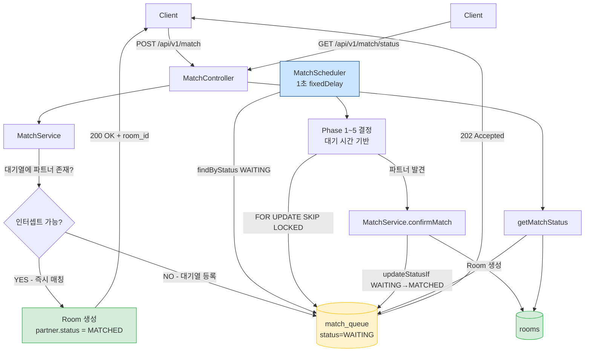
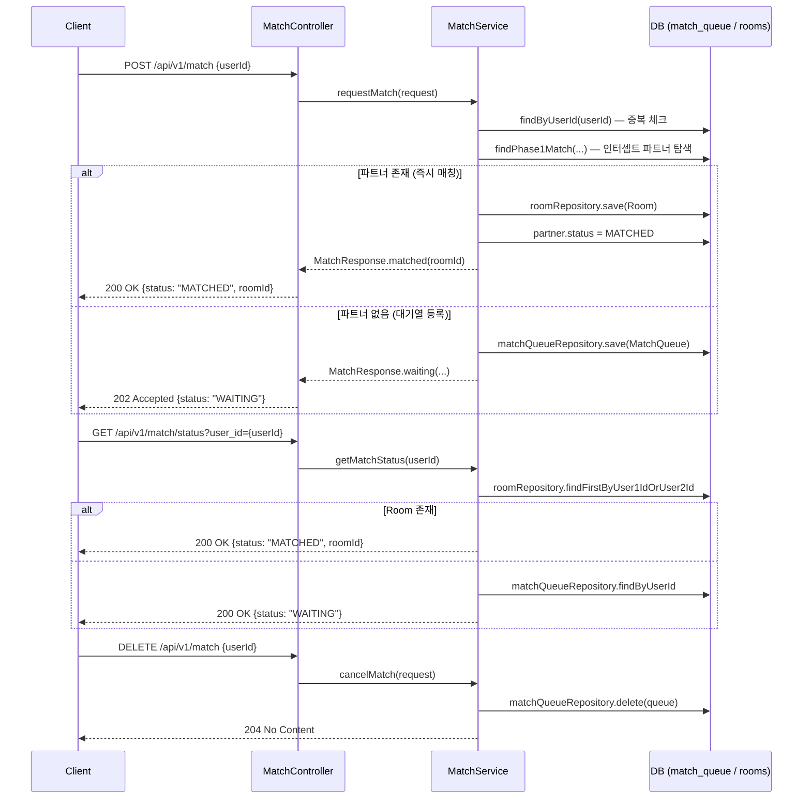
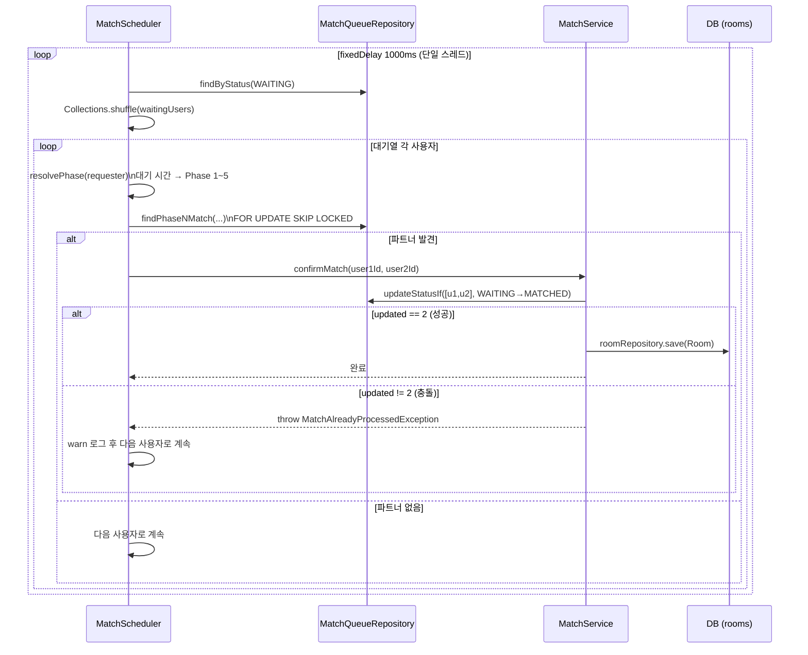
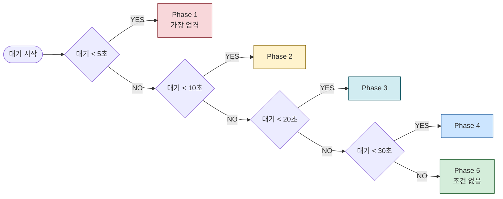
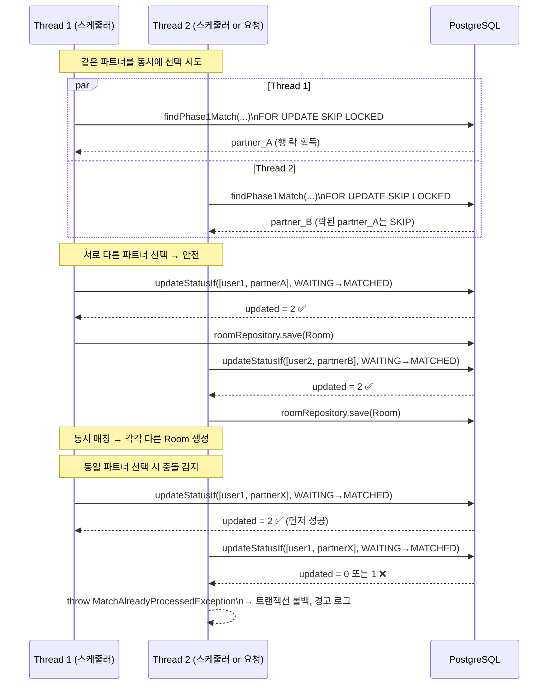
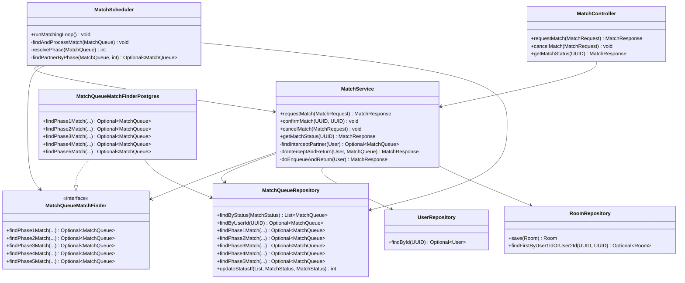
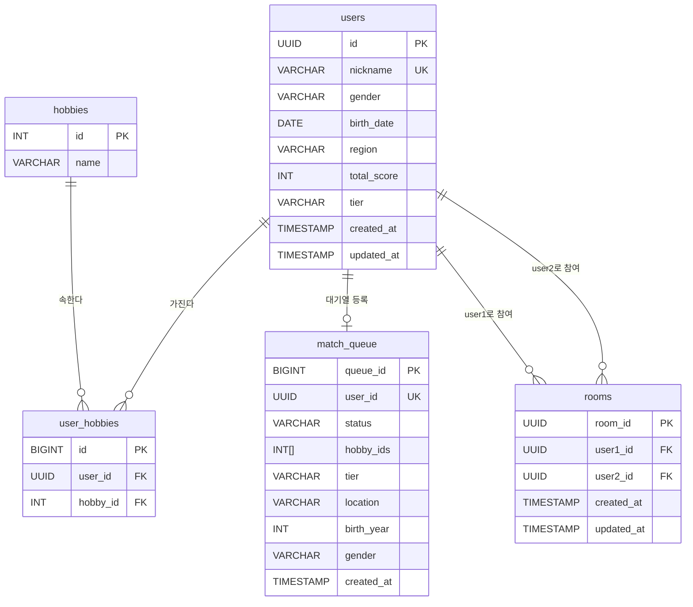
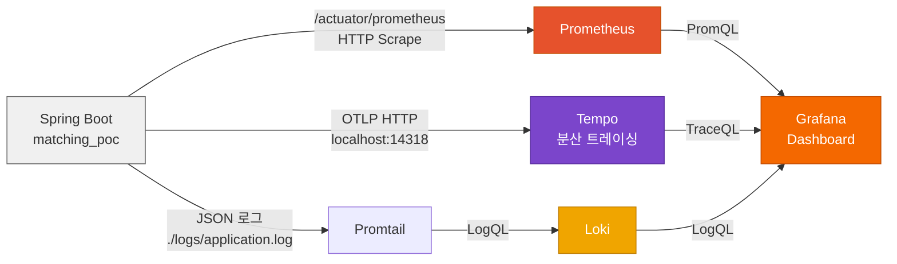

# 매칭 서비스 구조 문서

> 최종 업데이트: 2026-03-02

---

## 1. 시스템 개요

소셜 매칭 POC. 두 사용자를 빠르게 연결하는 것을 목표로 한다.

| 관심사 | 전략 |
|--------|------|
| 초저지연 매칭 | 요청 시 대기열 인터셉트(즉시 매칭) 우선 시도 |
| 동시성 안전 | `FOR UPDATE SKIP LOCKED` + `updateStatusIf` 원자적 벌크 업데이트 |
| 조건 완화 | 대기 시간에 따라 Phase 1→5 단계적 조건 완화 |
| 모니터링 | Micrometer 커스텀 메트릭 + OpenTelemetry 분산 트레이싱 |

### 핵심 컴포넌트

| 컴포넌트 | 역할 |
|----------|------|
| `MatchController` | REST API 진입점 (POST/DELETE/GET) |
| `MatchService` | 매칭 비즈니스 로직 (인터셉트, 대기열, 확정, 취소) |
| `MatchScheduler` | 1초 주기 대기열 스캔 및 Phase 기반 매칭 실행 |
| `MatchQueueMatchFinder` | Phase 1~5 쿼리 인터페이스 (PostgreSQL / H2 구현 분리) |
| `MatchQueueRepository` | `FOR UPDATE SKIP LOCKED` 네이티브 쿼리, `updateStatusIf` |

---

## 2. 전체 아키텍처

---

## 3. 매칭 요청 흐름

---

## 4. 스케줄러 매칭 확정 흐름

---

## 5. Phase 1~5 조건 완화

### 대기 시간 → Phase 결정

### 각 Phase 활성 조건

| Phase | 대기 시간 | 성별 반대 | 지역 일치 | 나이 ±5 | 취미 공통 | 등급 제외(FERTILIZER) |
|-------|----------|-----------|-----------|---------|-----------|----------------------|
| 1 | 0~5s | ✅ | ✅ | ✅ | ✅ | ✅ |
| 2 | 5~10s | ✅ | ✅ | ✅ | ❌ | ✅ |
| 3 | 10~20s | ✅ | ❌ | ✅ | ❌ | ✅ |
| 4 | 20~30s | ✅ | ❌ | ❌ | ❌ | ✅ |
| 5 | 30s+ | ❌ | ❌ | ❌ | ❌ | ❌ |

> **Phase 5**: `user_id != 본인`만 필터링. 모든 조건 완화.

---

## 6. 동시성 제어 메커니즘

### 핵심 안전장치

| 레이어 | 메커니즘 | 효과 |
|--------|---------|------|
| DB 쿼리 | `FOR UPDATE SKIP LOCKED` | 다른 트랜잭션이 락 중인 행은 건너뜀 → 스레드별 독립 파트너 선택 |
| 서비스 | `updateStatusIf` 벌크 업데이트 | `updated != 2`이면 `MatchAlreadyProcessedException` → 트랜잭션 롤백 |
| 스케줄러 | `catch MatchAlreadyProcessedException` | 경합 감지 후 warn 로그, 다음 사용자로 계속 진행 |

---

## 7. 컴포넌트 의존관계

---

## 8. 데이터 모델

> **match_queue.hobby_ids**: PostgreSQL `integer[]` 배열. GIN 인덱스(`&&` 연산자)로 취미 교집합 필터링.
> **match_queue.status**: `WAITING` → `MATCHED` 단방향 전이. `updateStatusIf`가 원자적으로 처리.

---

## 9. 모니터링 스택

### 커스텀 메트릭

| 메트릭 이름 | 타입 | 설명 |
|------------|------|------|
| `match.request.immediate` | Counter | 즉시 매칭(인터셉트) 성공 횟수 |
| `match.request.enqueued` | Counter | 대기열 등록 횟수 |
| `match.confirm.success` | Counter | 스케줄러 매칭 확정 성공 횟수 |
| `match.confirm.conflict` | Counter | `updateStatusIf` 충돌 횟수 (`MatchAlreadyProcessedException`) |
| `match.queue.waiting.count` | Gauge | 현재 WAITING 상태 대기열 인원 수 |
| `match.scheduler.loop` | Observation | 스케줄러 루프 1회 실행 스팬 (Tempo) |
| `match.attempt` | Observation | 개별 매칭 시도 스팬. `phase`, `result` 태그 포함 |

> `match.attempt`의 `result` 태그: `matched` / `none` / `conflict` / `error`
